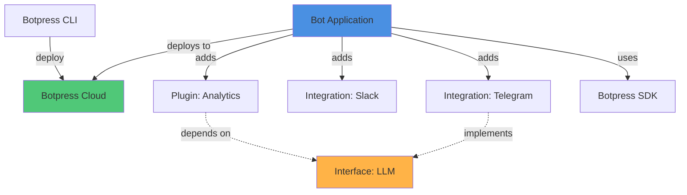
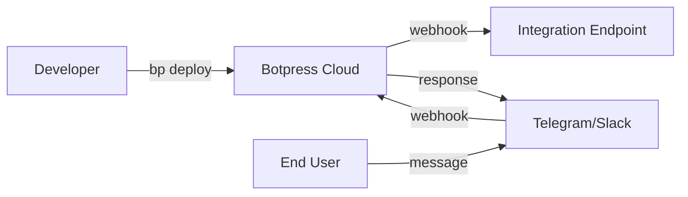
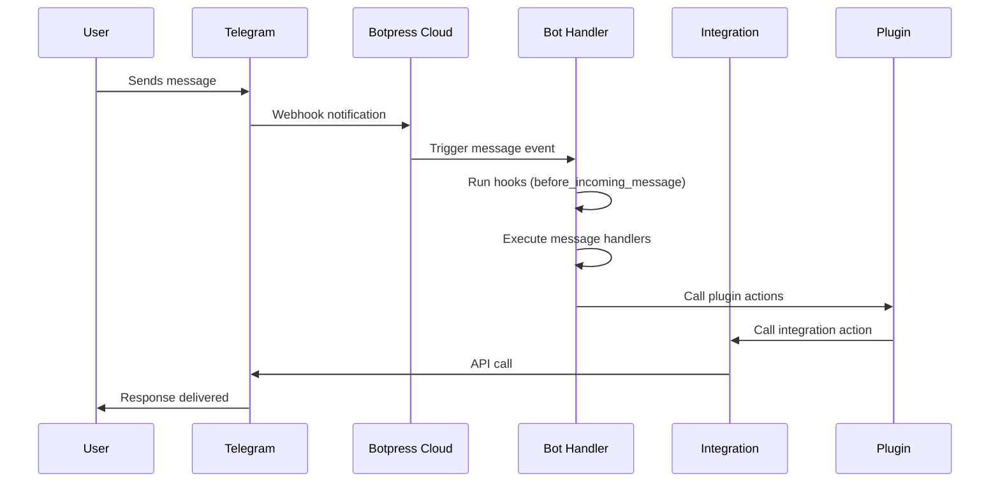

## Overview

Botpress is a comprehensive platform for building conversational AI applications. The architecture is designed around four core concepts that work together to create powerful, extensible bots:

- **Bots** - The main conversational applications that interact with users
- **Integrations** - Connections to external platforms and services (Telegram, Slack, etc.)
- **Plugins** - Reusable functionality that extends bot capabilities
- **Interfaces** - Abstract contracts that define standard behaviors



## System Architecture

### Core Components

#### SDK (`@botpress/sdk`)

The SDK is the foundation of all Botpress development. It provides:

- Type-safe definitions for bots, integrations, plugins, and interfaces
- Runtime handlers for processing messages, events, and actions
- Client libraries for interacting with Botpress Cloud APIs
- Development utilities and helpers

Key SDK classes from `packages/sdk/src/`:

```typescript
// Bot definition
class BotDefinition {
  addIntegration(integration, config)
  addPlugin(plugin, config)
  // Define states, events, actions, etc.
}

// Integration definition  
class IntegrationDefinition {
  extend(interface, builder)
  // Define channels, configuration, entities, etc.
}

// Plugin definition
class PluginDefinition {
  // Define actions, states, events, etc.
  // Declare interface and integration dependencies
}
```

#### CLI (`@botpress/cli`)

The CLI tool manages the development lifecycle:

```bash
bp init        # Create new bot/integration/plugin
bp deploy      # Deploy to Botpress Cloud
bp dev         # Local development mode
```

### Deployment Models

#### Cloud-Hosted (Recommended)



In cloud deployment:
- Bots run on Botpress Cloud infrastructure
- Automatic scaling and reliability
- Integrated with Botpress Studio for visual editing
- Centralized state management and analytics

#### Self-Hosted

```typescript
import { BotImplementation } from '@botpress/sdk'

const bot = new BotImplementation({
  actions: { /* ... */ },
  plugins: { /* ... */ }
})

// Start local HTTP server
await bot.start(8072)
```

From `packages/sdk/src/serve.ts:28`, bots can run as standalone HTTP servers for self-hosted scenarios.

## Component Interaction

### How Bots Use Integrations

Bots add integrations to connect to external platforms:

```typescript
import telegram from '@botpress/telegram'

const bot = new BotDefinition({
  // ... bot config
})

bot.addIntegration(telegram, {
  alias: 'mainChannel',
  configuration: {
    botToken: process.env.TELEGRAM_TOKEN
  }
})
```

The integration provides:
- **Channels**: Where messages flow (Telegram channels, Slack workspaces)
- **Events**: Platform-specific events (message received, user joined)
- **Actions**: Operations to perform (send message, upload file)
- **Entities**: Platform data models (users, conversations)

### How Plugins Extend Functionality

Plugins add reusable features that work across any bot:

```typescript
import analytics from '@botpress/analytics'
import anthropic from '@botpress/anthropic'

bot.addIntegration(anthropic, { 
  alias: 'ai',
  configuration: { apiKey: process.env.ANTHROPIC_KEY }
})

bot.addPlugin(analytics, {
  alias: 'analytics',
  dependencies: {
    llm: {
      integrationAlias: 'ai',
      integrationInterfaceAlias: 'llm'
    }
  }
})
```

From `packages/sdk/src/bot/definition.ts:281`, plugins:
- Declare dependencies on interfaces or integrations
- Get automatically wired to backing integrations at runtime
- Contribute actions, states, and event handlers to the bot

### How Interfaces Enable Interoperability

Interfaces define contracts that integrations implement:

```typescript
// Interface definition (packages/sdk/src/interface/definition.ts)
class InterfaceDefinition {
  entities: { modelRef: { schema: z.object({...}) } }
  actions: { generateContent: { input, output } }
}

// Integration extends interface
integration.extend(llmInterface, ({ entities }) => ({
  entities: {
    modelRef: entities.myModelSchema // Maps to interface entity
  }
}))
```

This allows:
- Plugins to work with any integration implementing an interface
- Swappable backends (switch from OpenAI to Anthropic without changing plugin code)
- Type-safe polymorphism across integrations

## Request Flow

Here's how a typical user message flows through the system:



From `packages/sdk/src/bot/implementation.ts:281`, bots support:

- **Message handlers**: `bot.on.message('text', async ({ message }) => {...})`
- **Event handlers**: `bot.on.event('userJoined', async ({ event }) => {...})`
- **Hooks**: Execute before/after messages and events
- **Action handlers**: Custom actions that workflows can call

## Development Workflow

<Steps>
  <Step title="Initialize">
    Create a new bot, integration, or plugin:
    ```bash
    bp init
    ```
  </Step>
  
  <Step title="Define">
    Define the structure using SDK classes:
    ```typescript
    const bot = new BotDefinition({ ... })
    ```
  </Step>
  
  <Step title="Implement">
    Implement handlers and business logic:
    ```typescript
    const impl = new BotImplementation({
      actions: { ... },
      plugins: { ... }
    })
    ```
  </Step>
  
  <Step title="Deploy">
    Deploy to Botpress Cloud:
    ```bash
    bp deploy
    ```
  </Step>
</Steps>

## State Management

Botpress provides four state scopes (from `packages/sdk/src/bot/definition.ts:23`):

- **`bot`**: Global state shared across all conversations
- **`user`**: State specific to a user across all conversations
- **`conversation`**: State for a specific conversation
- **`workflow`**: Temporary state within a workflow execution

```typescript
const bot = new BotDefinition({
  states: {
    userPreferences: {
      type: 'user',
      schema: z.object({
        language: z.string(),
        timezone: z.string()
      })
    },
    conversationContext: {
      type: 'conversation',
      schema: z.object({
        topic: z.string(),
        lastActivity: z.string()
      })
    }
  }
})
```

<Note>
State is automatically persisted and retrieved by Botpress Cloud. You don't need to manage databases or storage directly.
</Note>

## Next Steps

<CardGroup cols={2}>
  <Card title="Bots" icon="robot" href="/concepts/bots">
    Learn how to create and structure bots
  </Card>
  <Card title="Integrations" icon="plug" href="/concepts/integrations">
    Connect to external platforms and services
  </Card>
  <Card title="Plugins" icon="puzzle-piece" href="/concepts/plugins">
    Build reusable functionality
  </Card>
  <Card title="Interfaces" icon="shapes" href="/concepts/interfaces">
    Define standard contracts for interoperability
  </Card>
</CardGroup>