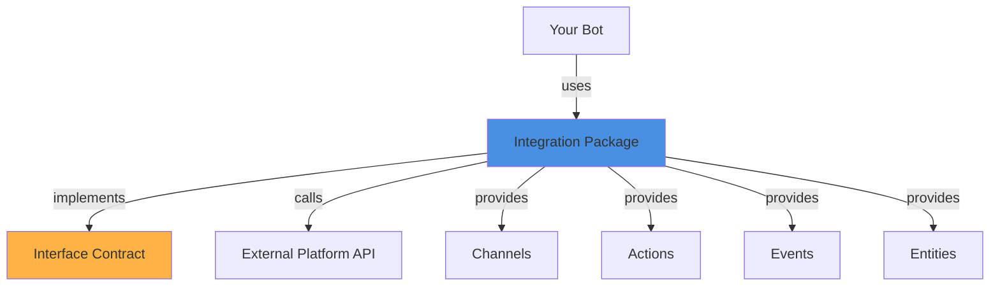

## What are Integrations?

Integrations are packages that connect Botpress bots to external platforms and services. They provide:

- **Channels**: Communication pathways (Telegram chats, Slack channels, etc.)
- **Actions**: Operations to perform on the platform (send message, create channel)
- **Events**: Platform-specific events (message received, user joined)
- **Entities**: Data models specific to the platform (users, conversations)

Integrations act as adapters between Botpress's unified bot interface and external platform APIs.

## Integration Architecture



## Creating an Integration

### Integration Definition

From `packages/sdk/src/integration/definition/index.ts:177`, integrations are defined using `IntegrationDefinition`:

```typescript
import { IntegrationDefinition, z } from '@botpress/sdk'

export default new IntegrationDefinition({
  name: 'telegram',
  version: '1.0.3',
  title: 'Telegram',
  description: 'Engage with your audience in real-time.',
  icon: 'icon.svg',
  readme: 'hub.md',
  
  // Configuration schema
  configuration: {
    schema: z.object({
      botToken: z.string().min(1).describe('Bot Token')
    })
  },
  
  // Define channels
  channels: {
    channel: {
      title: 'Telegram Channel',
      description: 'Send and receive messages via Telegram',
      
      // Message types supported
      messages: {
        text: {
          schema: z.object({
            text: z.string()
          })
        },
        image: {
          schema: z.object({
            imageUrl: z.string().url()
          })
        },
        // ... more message types
      },
      
      // Conversation tags (metadata)
      conversation: {
        tags: {
          id: { title: 'Chat ID' },
          chatId: { title: 'Telegram Chat ID' }
        }
      },
      
      // Message tags
      message: {
        tags: {
          id: { title: 'Message ID' },
          chatId: { title: 'Chat ID' }
        }
      }
    }
  },
  
  // Custom actions
  actions: {
    sendMessage: {
      title: 'Send Message',
      description: 'Send a message to a Telegram chat',
      input: {
        schema: z.object({
          chatId: z.string(),
          text: z.string()
        })
      },
      output: {
        schema: z.object({
          messageId: z.string()
        })
      }
    }
  },
  
  // Custom events
  events: {
    messageReceived: {
      schema: z.object({
        chatId: z.string(),
        text: z.string(),
        from: z.object({
          id: z.string(),
          username: z.string().optional()
        })
      })
    }
  },
  
  // User metadata
  user: {
    tags: {
      telegramId: { title: 'Telegram User ID' },
      username: { title: 'Telegram Username' }
    }
  },
  
  // Secrets for secure configuration
  secrets: {
    SENTRY_DSN: { description: 'Sentry DSN for error tracking' }
  },
  
  // Platform-specific entities
  entities: {
    telegramUser: {
      schema: z.object({
        id: z.string(),
        username: z.string().optional(),
        firstName: z.string(),
        lastName: z.string().optional()
      })
    }
  }
})
```

### Integration Implementation

The implementation lives in `src/index.ts`:

```typescript
import { IntegrationImplementation } from '@botpress/sdk'
import { Telegram } from 'telegram-api-client'

export default new IntegrationImplementation({
  // Register handler - runs when integration is installed
  register: async ({ webhookUrl, configuration, client }) => {
    const telegram = new Telegram(configuration.botToken)
    
    // Register webhook with Telegram
    await telegram.setWebhook({
      url: webhookUrl
    })
  },
  
  // Unregister handler - runs when integration is uninstalled
  unregister: async ({ configuration }) => {
    const telegram = new Telegram(configuration.botToken)
    await telegram.deleteWebhook()
  },
  
  // Action implementations
  actions: {
    sendMessage: async ({ input, configuration }) => {
      const telegram = new Telegram(configuration.botToken)
      
      const result = await telegram.sendMessage({
        chat_id: input.chatId,
        text: input.text
      })
      
      return {
        messageId: result.message_id.toString()
      }
    }
  },
  
  // Channel implementations
  channels: {
    channel: {
      messages: {
        text: async ({ payload, configuration, conversation }) => {
          const telegram = new Telegram(configuration.botToken)
          
          await telegram.sendMessage({
            chat_id: conversation.tags.chatId,
            text: payload.text
          })
        }
      }
    }
  },
  
  // Webhook handler
  handler: async ({ req, client, configuration }) => {
    if (req.path === '/webhook') {
      const update = JSON.parse(req.body || '{}')
      
      if (update.message) {
        // Get or create user
        const { user } = await client.getOrCreateUser({
          tags: {
            telegramId: update.message.from.id.toString(),
            username: update.message.from.username
          }
        })
        
        // Get or create conversation
        const { conversation } = await client.getOrCreateConversation({
          channel: 'channel',
          tags: {
            chatId: update.message.chat.id.toString()
          }
        })
        
        // Create message in Botpress
        await client.createMessage({
          conversationId: conversation.id,
          userId: user.id,
          type: 'text',
          payload: {
            text: update.message.text
          },
          tags: {
            messageId: update.message.message_id.toString()
          }
        })
      }
      
      return { status: 200 }
    }
  }
})
```

## Using Integrations in Bots

Add integrations to your bot:

```typescript
import telegram from '@botpress/telegram'
import { BotDefinition } from '@botpress/sdk'

const bot = new BotDefinition({})

bot.addIntegration(telegram, {
  alias: 'mainChannel',
  configuration: {
    botToken: process.env.TELEGRAM_BOT_TOKEN
  }
})

// Add multiple instances
bot.addIntegration(telegram, {
  alias: 'supportChannel',
  configuration: {
    botToken: process.env.TELEGRAM_SUPPORT_BOT_TOKEN
  }
})
```

<Info>
You can install multiple instances of the same integration with different configurations using unique aliases.
</Info>

## Implementing Interfaces

Integrations can implement interfaces to provide standard functionality. From `packages/sdk/src/integration/definition/index.ts:246`:

```typescript
import { IntegrationDefinition, z } from '@botpress/sdk'
import llmInterface from '@botpress/interface-llm'

const anthropicIntegration = new IntegrationDefinition({
  name: 'anthropic',
  version: '1.0.0',
  title: 'Anthropic',
  
  configuration: {
    schema: z.object({
      apiKey: z.string()
    })
  },
  
  // Define entities that map to interface entities
  entities: {
    model: {
      schema: z.object({
        id: z.string(),
        name: z.string(),
        maxTokens: z.number()
      })
    }
  }
})

// Extend the LLM interface
anthropicIntegration.extend(llmInterface, ({ entities }) => ({
  // Map integration entities to interface entities
  entities: {
    modelRef: entities.model
  },
  
  // Override interface action metadata
  actions: {
    generateContent: {
      name: 'generateContent',
      title: 'Generate Content with Claude',
      billable: true
    }
  }
}))

export default anthropicIntegration
```

### Why Implement Interfaces?

1. **Interoperability**: Plugins can use any integration implementing the same interface
2. **Standardization**: Common operations (LLM, storage, etc.) have consistent APIs
3. **Swappability**: Switch between providers without changing bot code

## Channels

Channels define how messages flow between the bot and platform:

```typescript
channels: {
  dm: {
    title: 'Direct Messages',
    messages: {
      text: { schema: z.object({ text: z.string() }) },
      image: { schema: z.object({ imageUrl: z.string() }) },
      file: { schema: z.object({ fileUrl: z.string() }) }
    }
  },
  group: {
    title: 'Group Chats',
    messages: {
      text: { schema: z.object({ text: z.string() }) }
    }
  }
}
```

Disable specific channels when adding to a bot:

```typescript
bot.addIntegration(slack, {
  configuration: { botToken: process.env.SLACK_TOKEN },
  disabledChannels: ['dm'] // Only allow group channels
})
```

## Multiple Configurations

Integrations can support multiple configuration schemas:

```typescript
new IntegrationDefinition({
  name: 'database',
  
  // Default configuration
  configuration: {
    schema: z.object({
      connectionString: z.string()
    })
  },
  
  // Alternative configurations
  configurations: {
    postgres: {
      schema: z.object({
        host: z.string(),
        port: z.number(),
        database: z.string(),
        username: z.string(),
        password: z.string()
      })
    },
    mongodb: {
      schema: z.object({
        uri: z.string(),
        database: z.string()
      })
    }
  }
})

// Use alternative configuration
bot.addIntegration(database, {
  configurationType: 'postgres',
  configuration: {
    host: 'localhost',
    port: 5432,
    database: 'mydb',
    username: 'user',
    password: 'pass'
  }
})
```

## Identity Extraction

Extract user identity from platform-specific data:

```typescript
new IntegrationDefinition({
  name: 'slack',
  
  identifier: {
    // VRL script to extract user ID
    extractScript: `
      .user.id = .body.event.user
    `,
    // Fallback handler for anonymous users
    fallbackHandlerScript: `
      .user.id = "anonymous"
    `
  }
})
```

## Secrets Management

Define secrets for sensitive configuration:

```typescript
new IntegrationDefinition({
  name: 'myintegration',
  
  secrets: {
    SENTRY_DSN: {
      description: 'Sentry DSN for error tracking'
    },
    API_SECRET: {
      description: 'Secret key for API authentication'
    }
  }
})

// Access in implementation
export default new IntegrationImplementation({
  actions: {
    callApi: async ({ ctx }) => {
      const secret = ctx.secrets.API_SECRET
      // Use secret in API calls
    }
  }
})
```

<Note>
Secrets are never exposed in logs or client-side code. They're only accessible server-side in action handlers.
</Note>

## States

Integrations can define their own state:

```typescript
new IntegrationDefinition({
  name: 'oauth-provider',
  
  states: {
    authToken: {
      type: 'integration',
      schema: z.object({
        accessToken: z.string(),
        refreshToken: z.string(),
        expiresAt: z.string()
      })
    }
  }
})
```

## Publishing Integrations

<Steps>
  <Step title="Develop">
    Create and test your integration locally:
    ```bash
    bp init
    # Select "Integration" template
    ```
  </Step>
  
  <Step title="Deploy Private">
    Deploy to your workspace for testing:
    ```bash
    bp deploy
    ```
  </Step>
  
  <Step title="Test">
    Install in a test bot and verify functionality
  </Step>
  
  <Step title="Deploy Public">
    Make it available on the Botpress Hub:
    ```bash
    bp deploy --visibility public
    ```
  </Step>
</Steps>

<Warning>
Once a version is deployed as public, it cannot be modified. Always test thoroughly with private deployments first.
</Warning>

## Advanced Features

### Custom Metadata

```typescript
new IntegrationDefinition({
  name: 'myintegration',
  
  attributes: {
    category: 'Communication & Channels',
    featured: 'true',
    pricing: 'free'
  }
})
```

### ESBuild Configuration

```typescript
new IntegrationDefinition({
  name: 'myintegration',
  
  __advanced: {
    esbuild: {
      external: ['some-native-module'],
      platform: 'node'
    }
  }
})
```

## Best Practices

<CardGroup cols={2}>
  <Card title="Error Handling" icon="shield-halved">
    Always handle external API errors gracefully. Use try-catch blocks and return meaningful error messages.
  </Card>
  
  <Card title="Rate Limiting" icon="gauge-high">
    Implement rate limiting to avoid hitting platform API limits. Use queues for high-volume operations.
  </Card>
  
  <Card title="Idempotency" icon="repeat">
    Make webhook handlers idempotent. The same webhook may be delivered multiple times.
  </Card>
  
  <Card title="Validation" icon="check-double">
    Validate all incoming data with Zod schemas. Never trust external data.
  </Card>
</CardGroup>

## Next Steps

<CardGroup cols={2}>
  <Card title="Interfaces" icon="shapes" href="/concepts/interfaces">
    Learn how to implement standard interfaces
  </Card>
  <Card title="Plugins" icon="puzzle-piece" href="/concepts/plugins">
    Use interfaces to build cross-platform plugins
  </Card>
  <Card title="Examples" icon="code" href="/integrations/creating-integrations">
    Browse integration examples
  </Card>
  <Card title="Hub" icon="store" href="https://app.botpress.cloud/hub">
    Explore published integrations
  </Card>
</CardGroup>