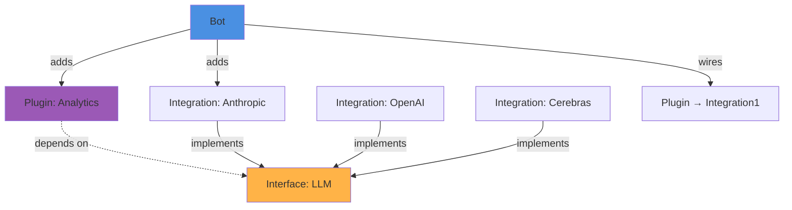

## What are Interfaces?

Interfaces are abstract contracts that define standard behaviors and data structures. They enable:

- **Interoperability**: Plugins work with any integration implementing an interface
- **Standardization**: Common operations have consistent APIs
- **Swappability**: Switch between providers without changing plugin code
- **Type Safety**: Strongly typed contracts enforced at compile and runtime

Interfaces act as the "glue" between plugins (consumers) and integrations (providers).

## Interface Architecture



## Creating an Interface

From `packages/sdk/src/interface/definition.ts:82`, interfaces are defined using `InterfaceDefinition`:

```typescript
import { InterfaceDefinition, z } from '@botpress/sdk'

export default new InterfaceDefinition({
  name: 'llm',
  version: '9.0.1',
  title: 'Large Language Model',
  description: 'Standard interface for LLM providers',
  
  // Define entities (shared data models)
  entities: {
    modelRef: {
      schema: z.object({
        id: z.string().describe('Model identifier'),
        provider: z.string().describe('Provider name'),
        capabilities: z.object({
          vision: z.boolean().optional(),
          functionCalling: z.boolean().optional(),
          streaming: z.boolean().optional()
        }).optional()
      })
    },
    message: {
      schema: z.object({
        role: z.enum(['user', 'assistant', 'system']),
        content: z.string()
      })
    }
  },
  
  // Define standard actions
  actions: {
    generateContent: {
      title: 'Generate Content',
      description: 'Generate text using the language model',
      billable: true,
      cacheable: true,
      input: {
        schema: ({ modelRef, message }) => z.object({
          model: modelRef,
          messages: z.array(message),
          temperature: z.number().min(0).max(2).optional(),
          maxTokens: z.number().positive().optional()
        })
      },
      output: {
        schema: ({ message }) => z.object({
          message: message,
          usage: z.object({
            inputTokens: z.number(),
            outputTokens: z.number()
          })
        })
      }
    },
    listLanguageModels: {
      title: 'List Models',
      description: 'List available language models',
      input: {
        schema: () => z.object({})
      },
      output: {
        schema: ({ modelRef }) => z.object({
          models: z.array(modelRef)
        })
      }
    }
  },
  
  // Define standard events (optional)
  events: {
    generationComplete: {
      schema: ({ modelRef }) => z.object({
        model: modelRef,
        duration: z.number(),
        tokenCount: z.number()
      })
    }
  },
  
  // Define channels (optional)
  channels: {
    stream: {
      messages: {
        chunk: {
          schema: () => z.object({
            content: z.string(),
            isComplete: z.boolean()
          })
        }
      }
    }
  }
})
```

## Interface Components

### Entities

Entities define shared data models that integrations must provide:

```typescript
entities: {
  // Basic entity
  modelRef: {
    schema: z.object({
      id: z.string(),
      name: z.string()
    })
  },
  
  // Entity with descriptions
  message: {
    schema: z.object({
      role: z.enum(['user', 'assistant'])
        .describe('Message role in conversation'),
      content: z.string()
        .describe('Message content')
    }).describe('A message in a conversation')
  }
}
```

<Info>
Entities are referenced using callbacks in actions, events, and channels. This enables type-safe generic schemas.
</Info>

### Actions

Actions define operations that integrations must implement:

```typescript
actions: {
  generateContent: {
    title: 'Generate Content',
    description: 'Generate text using the LLM',
    
    // Billable actions track usage for billing
    billable: true,
    
    // Cacheable actions can be cached for performance
    cacheable: true,
    
    // Input references entities
    input: {
      schema: ({ modelRef, message }) => z.object({
        model: modelRef,
        messages: z.array(message)
      })
    },
    
    // Output can also reference entities
    output: {
      schema: ({ message }) => z.object({
        response: message,
        usage: z.object({
          tokens: z.number()
        })
      })
    },
    
    // Custom attributes for metadata
    attributes: {
      rateLimit: '100/minute',
      timeout: '30s'
    }
  }
}
```

### Events

Events define notifications that integrations can emit:

```typescript
events: {
  modelUpdated: {
    schema: ({ modelRef }) => z.object({
      model: modelRef,
      updateType: z.enum(['added', 'removed', 'modified']),
      timestamp: z.string()
    }),
    attributes: {
      priority: 'low'
    }
  }
}
```

### Channels

Channels define communication pathways:

```typescript
channels: {
  streaming: {
    messages: {
      chunk: {
        schema: () => z.object({
          content: z.string(),
          done: z.boolean()
        })
      }
    }
  }
}
```

## Implementing Interfaces in Integrations

Integrations implement interfaces using the `extend()` method. From `packages/sdk/src/integration/definition/index.ts:246`:

```typescript
import { IntegrationDefinition, z } from '@botpress/sdk'
import llmInterface from '@botpress/interface-llm'

const anthropicIntegration = new IntegrationDefinition({
  name: 'anthropic',
  version: '1.0.0',
  
  configuration: {
    schema: z.object({
      apiKey: z.string()
    })
  },
  
  // Define integration's own entities
  entities: {
    claudeModel: {
      schema: z.object({
        id: z.string(),
        name: z.string(),
        maxTokens: z.number(),
        supportsVision: z.boolean()
      })
    }
  },
  
  // Define integration-specific actions
  actions: {
    generateContent: {
      title: 'Generate with Claude',
      input: {
        schema: z.object({
          model: z.string(),
          messages: z.array(z.object({
            role: z.string(),
            content: z.string()
          }))
        })
      },
      output: {
        schema: z.object({
          content: z.string()
        })
      }
    }
  }
})

// Extend the LLM interface
anthropicIntegration.extend(llmInterface, ({ entities }) => ({
  // Map integration entities to interface entities
  entities: {
    modelRef: entities.claudeModel
  },
  
  // Override action metadata (optional)
  actions: {
    generateContent: {
      name: 'generateContent',
      title: 'Generate Content with Claude',
      description: 'Use Claude to generate text'
    }
  },
  
  // Override event metadata (optional)
  events: {},
  
  // Override channel metadata (optional)
  channels: {}
}))

export default anthropicIntegration
```

### Entity Mapping

The `entities` store provides access to integration entities:

```typescript
anthropicIntegration.extend(llmInterface, ({ entities }) => {
  // entities.claudeModel is the integration's entity
  // We map it to the interface's modelRef entity
  return {
    entities: {
      modelRef: entities.claudeModel
    }
  }
})
```

<Note>
The integration's entity schema must be compatible with (extend) the interface's entity schema. Additional properties are allowed.
</Note>

## Using Interfaces in Plugins

Plugins declare interface dependencies. From `packages/sdk/src/plugin/definition.ts:162`:

```typescript
import { PluginDefinition, z } from '@botpress/sdk'
import llmInterface from '@botpress/interface-llm'

export default new PluginDefinition({
  name: 'content-generator',
  version: '1.0.0',
  
  // Declare interface dependency
  interfaces: {
    llm: llmInterface
  },
  
  configuration: {
    schema: z.object({
      defaultTemperature: z.number().default(0.7)
    })
  },
  
  actions: {
    generateBlogPost: {
      input: {
        // Reference interface entities using callback
        schema: ({ entities }) => z.object({
          topic: z.string(),
          model: entities.llm.modelRef,
          wordCount: z.number().default(1000)
        })
      },
      output: {
        schema: z.object({
          title: z.string(),
          content: z.string(),
          tokensUsed: z.number()
        })
      }
    }
  }
})
```

Implementation:

```typescript
import { PluginImplementation } from '@botpress/sdk'

export default new PluginImplementation({
  actions: {
    generateBlogPost: async ({ input, client, configuration }) => {
      // Call interface action - works with any LLM integration
      const result = await client.callAction({
        type: 'llm:generateContent',
        input: {
          model: input.model,
          messages: [{
            role: 'user',
            content: `Write a ${input.wordCount}-word blog post about: ${input.topic}`
          }],
          temperature: configuration.defaultTemperature
        }
      })
      
      return {
        title: extractTitle(result.message.content),
        content: result.message.content,
        tokensUsed: result.usage.inputTokens + result.usage.outputTokens
      }
    }
  }
})
```

## Wiring Interfaces in Bots

When adding plugins to bots, you wire interface dependencies to specific integrations:

```typescript
import { BotDefinition } from '@botpress/sdk'
import anthropic from '@botpress/anthropic'
import openai from '@botpress/openai'
import contentGenerator from './plugins/content-generator'

const bot = new BotDefinition({})

// Add integrations that implement the LLM interface
bot.addIntegration(anthropic, {
  alias: 'claude',
  configuration: { apiKey: process.env.ANTHROPIC_KEY }
})

bot.addIntegration(openai, {
  alias: 'gpt',
  configuration: { apiKey: process.env.OPENAI_KEY }
})

// Add plugin and wire to specific integration
bot.addPlugin(contentGenerator, {
  alias: 'generator',
  configuration: { defaultTemperature: 0.7 },
  dependencies: {
    llm: {
      integrationAlias: 'claude',        // Use Anthropic integration
      integrationInterfaceAlias: 'llm'   // Interface name within integration
    }
  }
})

// Could add another instance wired to different integration
bot.addPlugin(contentGenerator, {
  alias: 'gptGenerator',
  configuration: { defaultTemperature: 0.8 },
  dependencies: {
    llm: {
      integrationAlias: 'gpt',           // Use OpenAI integration
      integrationInterfaceAlias: 'llm'
    }
  }
})
```

<Info>
The same plugin can be added multiple times with different backing integrations, enabling A/B testing and fallbacks.
</Info>

## Entity Dereferencing

When using interface entities, references need to be resolved at runtime. From `packages/sdk/src/bot/definition.ts:506`:

```typescript
// In bot definition
const bot = new BotDefinition({
  // ... with plugins using interfaces
})

// Dereference all interface entity references
const dereferenced = bot.dereferencePluginEntities()
```

This replaces `z.ref()` with actual schemas from backing integrations.

## Built-in Interfaces

Botpress provides several standard interfaces:

<AccordionGroup>
  <Accordion title="LLM Interface">
    Standard interface for Large Language Models (OpenAI, Anthropic, Cerebras, etc.)
    
    **Entities**: `modelRef`, `message`  
    **Actions**: `generateContent`, `listLanguageModels`  
    **Location**: `@botpress/interface-llm`
  </Accordion>
  
  <Accordion title="Readable Interface">
    Standard interface for read operations on resources
    
    **Actions**: `read`, `list`  
    **Location**: `interfaces/readable/`
  </Accordion>
  
  <Accordion title="Creatable Interface">
    Standard interface for creating resources
    
    **Actions**: `create`  
    **Location**: `interfaces/creatable/`
  </Accordion>
  
  <Accordion title="Updatable Interface">
    Standard interface for updating resources
    
    **Actions**: `update`  
    **Location**: `interfaces/updatable/`
  </Accordion>
  
  <Accordion title="Deletable Interface">
    Standard interface for deleting resources
    
    **Actions**: `delete`  
    **Location**: `interfaces/deletable/`
  </Accordion>
  
  <Accordion title="HITL Interface">
    Human-in-the-loop interface for agent handoff
    
    **Actions**: `createTicket`, `assignAgent`, `closeTicket`  
    **Location**: `interfaces/hitl/`
  </Accordion>
</AccordionGroup>

## Interface Versioning

Interfaces use semantic versioning:

```typescript
new InterfaceDefinition({
  name: 'llm',
  version: '9.0.1'  // major.minor.patch
})
```

- **Major**: Breaking changes to entities, actions, or events
- **Minor**: New optional entities, actions, or events
- **Patch**: Bug fixes, documentation updates

<Warning>
Plugins should specify compatible interface versions. Breaking changes require updating both interface and implementations.
</Warning>

## Advanced: Generic Schemas

Interfaces use generic schemas with entity references:

```typescript
actions: {
  search: {
    input: {
      // Schema is a function receiving entity references
      schema: ({ entities }) => z.object({
        query: z.string(),
        filters: z.array(entities.filter).optional()
      })
    },
    output: {
      schema: ({ entities }) => z.object({
        results: z.array(entities.searchResult)
      })
    }
  }
}
```

From `packages/sdk/src/interface/definition.ts:119`, these callbacks receive entity references at definition time.

## Best Practices

<CardGroup cols={2}>
  <Card title="Minimal APIs" icon="minimize">
    Keep interfaces focused. Define only essential actions and entities for the use case.
  </Card>
  
  <Card title="Backward Compatibility" icon="arrow-rotate-left">
    Use minor versions for additions. Major versions for breaking changes.
  </Card>
  
  <Card title="Rich Metadata" icon="tag">
    Provide clear titles, descriptions, and attributes for all interface components.
  </Card>
  
  <Card title="Flexible Entities" icon="gears">
    Design entities to accommodate different provider implementations. Use optional fields.
  </Card>
</CardGroup>

## Example: Storage Interface

Complete example of a storage interface:

```typescript
import { InterfaceDefinition, z } from '@botpress/sdk'

export default new InterfaceDefinition({
  name: 'storage',
  version: '1.0.0',
  title: 'Storage Interface',
  description: 'Standard interface for storage providers',
  
  entities: {
    file: {
      schema: z.object({
        id: z.string(),
        name: z.string(),
        size: z.number(),
        mimeType: z.string(),
        url: z.string().url()
      })
    },
    folder: {
      schema: z.object({
        id: z.string(),
        name: z.string(),
        path: z.string()
      })
    }
  },
  
  actions: {
    uploadFile: {
      title: 'Upload File',
      input: {
        schema: ({ folder }) => z.object({
          content: z.string(),
          fileName: z.string(),
          folder: folder.optional()
        })
      },
      output: {
        schema: ({ file }) => z.object({
          file: file
        })
      }
    },
    downloadFile: {
      title: 'Download File',
      input: {
        schema: ({ file }) => z.object({
          file: file
        })
      },
      output: {
        schema: () => z.object({
          content: z.string()
        })
      }
    },
    listFiles: {
      title: 'List Files',
      input: {
        schema: ({ folder }) => z.object({
          folder: folder.optional()
        })
      },
      output: {
        schema: ({ file }) => z.object({
          files: z.array(file)
        })
      }
    }
  }
})
```

## Next Steps

<CardGroup cols={2}>
  <Card title="Integrations" icon="plug" href="/concepts/integrations">
    Learn how to implement interfaces in integrations
  </Card>
  <Card title="Plugins" icon="puzzle-piece" href="/concepts/plugins">
    Use interfaces to build cross-platform plugins
  </Card>
  <Card title="Examples" icon="code" href="/concepts/interfaces">
    Browse interface examples
  </Card>
  <Card title="Architecture" icon="sitemap" href="/concepts/architecture">
    Understand how interfaces fit into the platform
  </Card>
</CardGroup>