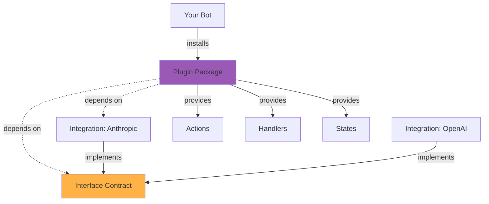

## What are Plugins?

Plugins are reusable packages that extend bot functionality without being tied to a specific platform. They work across any bot and can integrate with multiple platforms through interfaces.

Plugins provide:

- **Actions**: Reusable operations (analytics tracking, logging)
- **States**: Data schemas (analytics data, configuration)
- **Events**: Custom events (metrics recorded, thresholds exceeded)
- **Event Handlers**: React to bot events
- **Message Handlers**: Process messages
- **Tables**: Custom data storage

## Plugin Architecture



## Creating a Plugin

### Plugin Definition

From `packages/sdk/src/plugin/definition.ts:162`, plugins are defined using `PluginDefinition`:

```typescript
import { PluginDefinition, z } from '@botpress/sdk'
import llmInterface from '@botpress/interface-llm'

export default new PluginDefinition({
  name: 'analytics',
  version: '1.0.0',
  title: 'Analytics Plugin',
  description: 'Track and analyze bot interactions',
  icon: 'icon.svg',
  
  // Declare interface dependencies
  interfaces: {
    llm: llmInterface
  },
  
  // Plugin configuration
  configuration: {
    schema: z.object({
      trackingEnabled: z.boolean().default(true),
      sampleRate: z.number().min(0).max(1).default(1.0)
    })
  },
  
  // Plugin-specific states
  states: {
    metrics: {
      type: 'bot',
      schema: z.object({
        totalMessages: z.number(),
        totalTokens: z.number(),
        lastReset: z.string()
      })
    },
    userMetrics: {
      type: 'user',
      schema: z.object({
        messageCount: z.number(),
        firstSeen: z.string(),
        lastSeen: z.string()
      })
    }
  },
  
  // Custom events
  events: {
    metricRecorded: {
      schema: z.object({
        metricName: z.string(),
        value: z.number(),
        timestamp: z.string()
      })
    },
    thresholdExceeded: {
      schema: z.object({
        threshold: z.string(),
        currentValue: z.number(),
        maxValue: z.number()
      })
    }
  },
  
  // Plugin actions
  actions: {
    trackEvent: {
      title: 'Track Event',
      description: 'Record an analytics event',
      input: {
        schema: z.object({
          name: z.string(),
          properties: z.record(z.string(), z.any()).optional()
        })
      },
      output: {
        schema: z.object({
          recorded: z.boolean()
        })
      }
    },
    getMetrics: {
      title: 'Get Metrics',
      description: 'Retrieve analytics metrics',
      input: {
        schema: z.object({
          timeRange: z.enum(['hour', 'day', 'week', 'month'])
        })
      },
      output: {
        schema: z.object({
          totalMessages: z.number(),
          activeUsers: z.number(),
          avgResponseTime: z.number()
        })
      }
    }
  },
  
  // Custom tables for analytics data
  tables: {
    events: {
      schema: z.object({
        eventName: z.string(),
        userId: z.string(),
        timestamp: z.string(),
        properties: z.record(z.string(), z.any())
      }),
      indexes: ['eventName', 'userId', 'timestamp']
    }
  },
  
  // User/conversation/message tags
  user: {
    tags: {
      analyticsId: { title: 'Analytics User ID' }
    }
  },
  conversation: {
    tags: {
      sessionId: { title: 'Analytics Session ID' }
    }
  },
  message: {
    tags: {
      tracked: { title: 'Analytics Tracked' }
    }
  }
})
```

### Plugin Implementation

Implement the plugin's runtime behavior:

```typescript
import { PluginImplementation } from '@botpress/sdk'

export default new PluginImplementation({
  // Action implementations
  actions: {
    trackEvent: async ({ input, client, ctx }) => {
      // Store event in table
      await client.createTableRow({
        table: 'events',
        row: {
          eventName: input.name,
          userId: ctx.userId,
          timestamp: new Date().toISOString(),
          properties: input.properties || {}
        }
      })
      
      // Update metrics state
      const { state } = await client.getState({
        type: 'user',
        id: ctx.userId,
        name: 'analytics:userMetrics'
      })
      
      await client.setState({
        type: 'user',
        id: ctx.userId,
        name: 'analytics:userMetrics',
        payload: {
          messageCount: (state.messageCount || 0) + 1,
          lastSeen: new Date().toISOString(),
          firstSeen: state.firstSeen || new Date().toISOString()
        }
      })
      
      return { recorded: true }
    },
    
    getMetrics: async ({ input, client }) => {
      // Query analytics data
      const { rows } = await client.listTableRows({
        table: 'events',
        filter: {
          // Filter by time range
        }
      })
      
      return {
        totalMessages: rows.length,
        activeUsers: new Set(rows.map(r => r.userId)).size,
        avgResponseTime: calculateAverage(rows)
      }
    }
  },
  
  // Message handler
  messageHandler: async ({ message, client, ctx }) => {
    // Track all messages automatically
    await client.callAction({
      type: 'analytics:trackEvent',
      input: {
        name: 'message_received',
        properties: {
          messageType: message.type,
          conversationId: ctx.conversationId
        }
      }
    })
  },
  
  // Event handler
  eventHandler: async ({ event, client }) => {
    // React to custom events
    if (event.type === 'analytics:thresholdExceeded') {
      console.warn('Threshold exceeded:', event.payload)
    }
  }
})
```

## Using Interface Dependencies

Plugins can depend on interfaces to work with any compatible integration:

```typescript
import { PluginDefinition, z } from '@botpress/sdk'
import llmInterface from '@botpress/interface-llm'

export default new PluginDefinition({
  name: 'sentiment-analysis',
  version: '1.0.0',
  
  // Declare interface dependency
  interfaces: {
    llm: llmInterface
  },
  
  actions: {
    analyzeSentiment: {
      input: {
        // Reference interface entities
        schema: ({ entities }) => z.object({
          text: z.string(),
          model: entities.llm.modelRef
        })
      },
      output: {
        schema: z.object({
          sentiment: z.enum(['positive', 'negative', 'neutral']),
          score: z.number()
        })
      }
    }
  }
})
```

Implementation using the interface:

```typescript
export default new PluginImplementation({
  actions: {
    analyzeSentiment: async ({ input, client }) => {
      // Call LLM interface action
      // Works with any LLM integration (Anthropic, OpenAI, etc.)
      const result = await client.callAction({
        type: 'llm:generateContent',
        input: {
          model: input.model,
          messages: [{
            role: 'user',
            content: `Analyze the sentiment of: ${input.text}`
          }]
        }
      })
      
      return {
        sentiment: parseSentiment(result.content),
        score: calculateScore(result.content)
      }
    }
  }
})
```

## Using Integration Dependencies

Plugins can also depend directly on specific integrations:

```typescript
import anthropic from '@botpress/anthropic'

export default new PluginDefinition({
  name: 'claude-assistant',
  version: '1.0.0',
  
  // Direct integration dependency
  integrations: {
    anthropic: anthropic
  },
  
  actions: {
    askClaude: {
      input: {
        schema: z.object({
          question: z.string()
        })
      },
      output: {
        schema: z.object({
          answer: z.string()
        })
      }
    }
  }
})
```

## Installing Plugins in Bots

From `packages/sdk/src/bot/definition.ts:281`, add plugins to bots:

```typescript
import { BotDefinition } from '@botpress/sdk'
import analytics from '@botpress/analytics'
import anthropic from '@botpress/anthropic'
import llmInterface from '@botpress/interface-llm'

const bot = new BotDefinition({})

// First, add integrations that implement required interfaces
bot.addIntegration(anthropic, {
  alias: 'llm',
  configuration: {
    apiKey: process.env.ANTHROPIC_API_KEY
  }
})

// Then add the plugin and wire dependencies
bot.addPlugin(analytics, {
  alias: 'analytics',
  configuration: {
    trackingEnabled: true,
    sampleRate: 1.0
  },
  dependencies: {
    // Map plugin interface to integration
    llm: {
      integrationAlias: 'llm',              // Bot's integration alias
      integrationInterfaceAlias: 'llm'      // Integration's interface alias
    }
  }
})
```

<Info>
Plugin actions and states are automatically prefixed with the plugin alias. For example, `analytics:trackEvent` and `analytics:userMetrics`.
</Info>

## Plugin State Scoping

Plugin states are namespaced to avoid conflicts:

```typescript
// In bot code
const { state } = await client.getState({
  type: 'user',
  id: ctx.userId,
  name: 'analytics:userMetrics'  // Prefixed with plugin alias
})
```

From `packages/sdk/src/consts.ts`, the separator between plugin alias and name is `:`.

## Plugin Actions

Call plugin actions from bot handlers:

```typescript
import { BotImplementation } from '@botpress/sdk'

const botImpl = new BotImplementation({
  actions: {},
  plugins: {}
})

botImpl.on.message('text', async ({ message, client, ctx }) => {
  // Call plugin action
  await client.callAction({
    type: 'analytics:trackEvent',
    input: {
      name: 'user_message',
      properties: {
        text: message.payload.text
      }
    }
  })
})
```

## Plugin Event Handlers

Plugins can register event handlers that run automatically:

```typescript
export default new PluginImplementation({
  messageHandler: async ({ message, client }) => {
    // Runs for every message
    console.log('Message received:', message.type)
  },
  
  eventHandler: async ({ event, client }) => {
    // Runs for every event
    console.log('Event received:', event.type)
  }
})
```

These handlers run in addition to the bot's own handlers.

## Plugin Hooks

Plugins can register hooks to intercept and modify data:

```typescript
export default new PluginImplementation({
  beforeMessageHandler: async ({ message }) => {
    // Modify message before processing
    message.tags.processed = 'true'
  },
  
  afterMessageHandler: async ({ message }) => {
    // Execute after message processing
    console.log('Message processed:', message.id)
  }
})
```

## Dereferencing Entities

When using interface entities, you may need to dereference them. From `packages/sdk/src/plugin/definition.ts:352`:

```typescript
const plugin = new PluginDefinition({
  // ... definition with interface entities
})

// Dereference entities to concrete schemas
const dereferenced = plugin.dereferenceEntities({
  intersectWithUnknownRecord: true  // Allows additional properties
})
```

This resolves `z.ref()` entities to their actual schemas.

## Tables in Plugins

Plugins can define custom tables:

```typescript
new PluginDefinition({
  name: 'crm',
  tables: {
    customers: {
      schema: z.object({
        customerId: z.string(),
        email: z.string().email(),
        name: z.string(),
        tags: z.array(z.string()),
        metadata: z.record(z.string(), z.any())
      }),
      indexes: ['email', 'customerId']
    },
    interactions: {
      schema: z.object({
        customerId: z.string(),
        type: z.enum(['email', 'chat', 'call']),
        timestamp: z.string(),
        notes: z.string()
      }),
      indexes: ['customerId', 'timestamp']
    }
  }
})
```

Use tables in actions:

```typescript
export default new PluginImplementation({
  actions: {
    getCustomer: async ({ input, client }) => {
      const { rows } = await client.listTableRows({
        table: 'crm:customers',
        filter: { email: input.email }
      })
      return rows[0]
    }
  }
})
```

## Recurring Events

Plugins can emit scheduled events:

```typescript
new PluginDefinition({
  name: 'scheduler',
  
  events: {
    dailyReport: {
      schema: z.object({
        date: z.string(),
        metrics: z.record(z.string(), z.number())
      })
    }
  },
  
  recurringEvents: {
    dailyReport: {
      type: 'dailyReport',
      payload: { /* ... */ },
      schedule: {
        cron: '0 9 * * *'  // Every day at 9 AM
      }
    }
  }
})
```

## Workflows (Experimental)

Plugins can define workflows:

```typescript
new PluginDefinition({
  name: 'onboarding',
  
  workflows: {
    userOnboarding: {
      title: 'User Onboarding',
      input: {
        schema: z.object({
          userId: z.string(),
          plan: z.string()
        })
      },
      output: {
        schema: z.object({
          completed: z.boolean(),
          steps: z.array(z.string())
        })
      }
    }
  }
})
```

## Plugin Merging

From `packages/sdk/src/bot/definition.ts:370`, when plugins are added to bots:

1. Plugin states, events, and actions are prefixed with the plugin alias
2. User/conversation/message tags are merged (no prefixing)
3. Tables and workflows are merged directly

```typescript
// Plugin defines: action "track"
// In bot becomes: "analytics:track"

// Plugin defines: user tag "analyticsId"
// In bot becomes: user tag "analyticsId" (no prefix)
```

## Publishing Plugins

<Steps>
  <Step title="Develop">
    Create your plugin:
    ```bash
    bp init
    # Select "Plugin" template
    ```
  </Step>
  
  <Step title="Build">
    Build the plugin implementation:
    ```bash
    npm run build
    ```
  </Step>
  
  <Step title="Deploy Private">
    Deploy to your workspace:
    ```bash
    bp deploy
    ```
  </Step>
  
  <Step title="Test">
    Install in test bots and verify functionality
  </Step>
  
  <Step title="Deploy Public">
    Publish to the Botpress Hub:
    ```bash
    bp deploy --visibility public
    ```
  </Step>
</Steps>

## Best Practices

<CardGroup cols={2}>
  <Card title="Use Interfaces" icon="shapes">
    Depend on interfaces instead of specific integrations for maximum reusability.
  </Card>
  
  <Card title="Namespace Properly" icon="tag">
    Plugin states and actions are automatically prefixed. Design accordingly.
  </Card>
  
  <Card title="Document Dependencies" icon="book">
    Clearly document which interfaces or integrations your plugin requires.
  </Card>
  
  <Card title="Handle Errors" icon="triangle-exclamation">
    Gracefully handle cases where dependencies aren't available or properly configured.
  </Card>
</CardGroup>

## Examples

### Simple Analytics Plugin

```typescript
export default new PluginDefinition({
  name: 'analytics',
  version: '0.0.1',
  configuration: { schema: z.object({}) },
  actions: {
    track: {
      input: {
        schema: z.object({
          name: z.string(),
          count: z.number()
        })
      },
      output: {
        schema: z.object({})
      }
    }
  }
})
```

### Plugin with Interface Dependency

```typescript
import llmInterface from '@botpress/interface-llm'

export default new PluginDefinition({
  name: 'summarizer',
  version: '1.0.0',
  interfaces: {
    llm: llmInterface
  },
  actions: {
    summarize: {
      input: {
        schema: ({ entities }) => z.object({
          text: z.string(),
          model: entities.llm.modelRef
        })
      },
      output: {
        schema: z.object({
          summary: z.string()
        })
      }
    }
  }
})
```

## Next Steps

<CardGroup cols={2}>
  <Card title="Interfaces" icon="shapes" href="/concepts/interfaces">
    Learn how to use interfaces in plugins
  </Card>
  <Card title="Bots" icon="robot" href="/concepts/bots">
    Install plugins in your bots
  </Card>
  <Card title="Examples" icon="code" href="/plugins/creating-plugins">
    Browse plugin examples
  </Card>
  <Card title="SDK Reference" icon="book" href="/sdk/introduction">
    Explore the complete plugin API
  </Card>
</CardGroup>